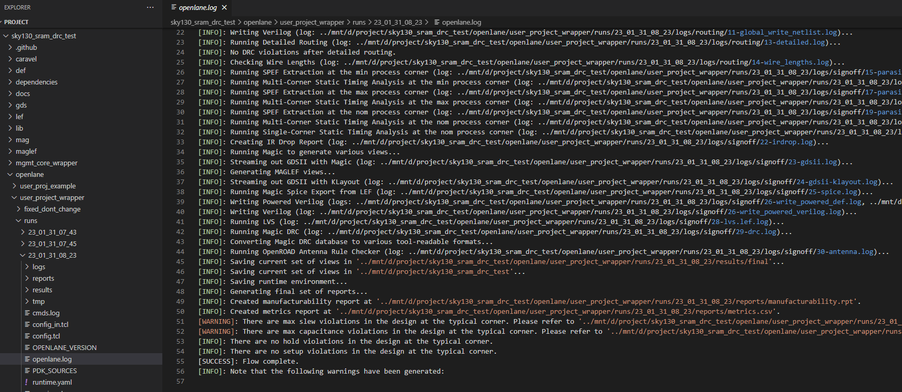

# MPW-Precheck on SKY130 SRAM Macro Test Project

* Goal: Generate SKY130 SRAM Macro in GDS, then pass MPW-Precheck validations.
* Related Reference: [Using SRAM with OpenMPW by vlsi.jp](https://vlsi.jp/OpenMPWSRAM_eng.html), but need some modification as this repo for new mpw-precheck environment.
* Author: Watson Huang (wats0n.edx@gmail.com)

------
### Usage Guide

1. Set-up Environment
    ```
    $ source env_setup.sh
    ```
2. Perform RTL-to-GDS flow
    ```
    $ make user_project_wrapper
    ```
3. MPW-Precheck
    ```
    $ make run-precheck
    ```

------
### Results

1. RTL-to-GDS Flow
    
    * [1] MPW OpenLane Flow Logs<br />
    
    * [2] Post-Routing Layout in OpenRoad-GUI<br />
    
    * [3] Sign-Off Layout in Klayout<br />
    
    * [4] Pass MPW-Precheck, include Magic/Klayout DRC-Checks<br />
    

------
### Work-Around

1. Magic DRC translate to other exchangeable form issue
    * Disable feature as Ref.[1] in `openlane\user_project_wrapper\config.json`
    ```
        "MAGIC_DRC_USE_GDS": false,
        "QUIT_ON_MAGIC_DRC": false,
        "RUN_KLAYOUT_XOR": false,
    ```
    * Check the DRC-Rules in MPW-Precheck flow

------
### Reference
   
* [1]. OpenLane Tutorial
    * [Designing a chip with an OpenRAM (sky130)](https://openlane.readthedocs.io/en/latest/tutorials/openram.html)
* [2]. Sky130 SRAM Macro DRC work-around discussion
    * [efabless/mpw_precheck: Precheck crash with SRAM DRC](https://github.com/efabless/mpw_precheck/issues/180)

------
